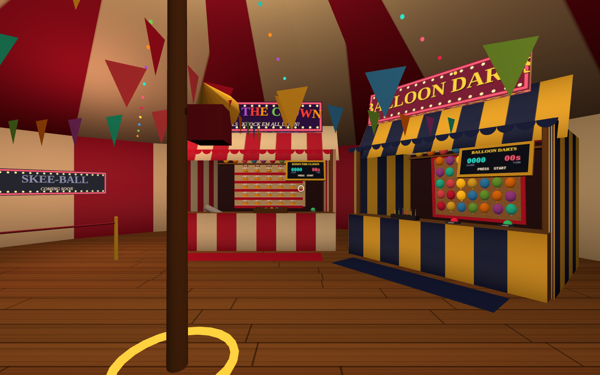
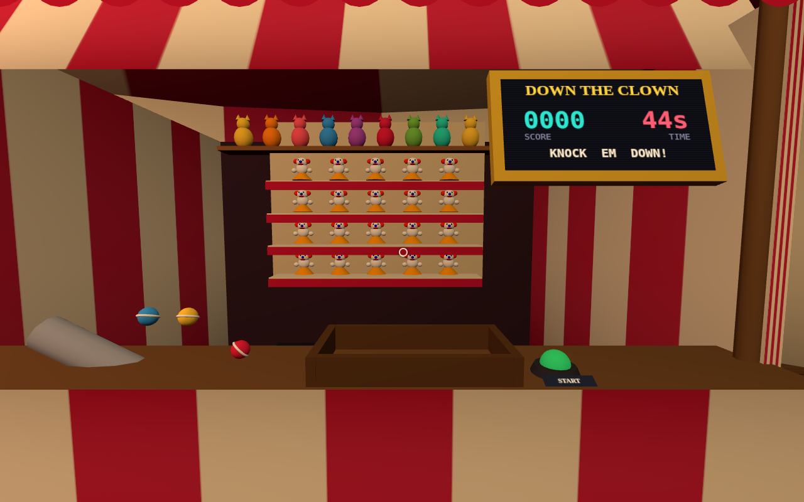
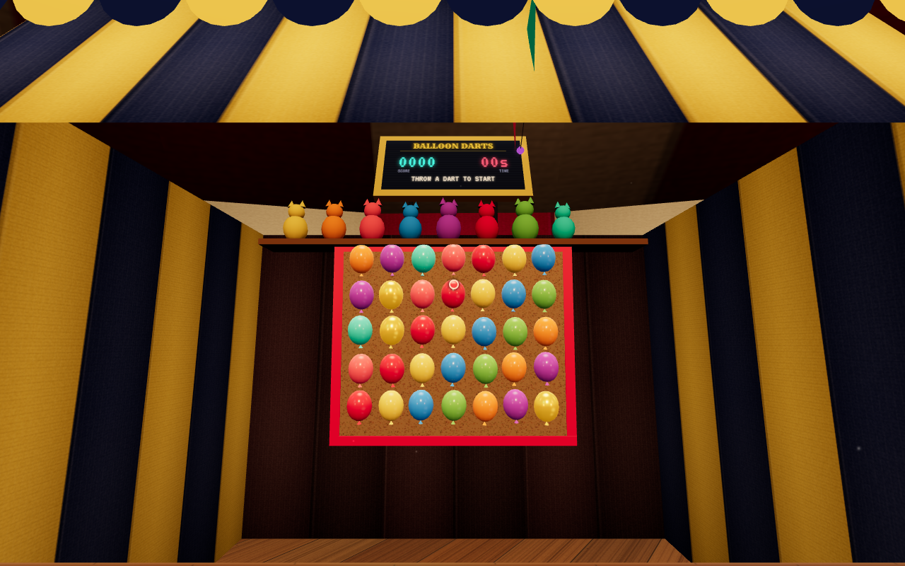

# 🎪 Carnival Arcade VR

A Meta Quest / WebXR carnival arcade inside a cozy funhouse big-top:
striped canvas, string lights, bunting, ragtime piano from a horn speaker
on the centre pole — and a ring of physical game booths you walk or
teleport between.

The tent sits in the middle of a living night **midway**: laced canvas
windows between the booths (and the entrance doorway) look out on a lit
Ferris wheel slowly turning, glowing food stalls all the way around, a
carousel, a high striker, strolling silhouette crowds, sweeping
searchlights and fireworks bursting over the treeline — with their booms
arriving a beat late, the way distant fireworks do.

Your hands are big white **carnival gloves**: fingers curl with the
trigger, and the cuff band (blue left, orange right) glows when your
hand is near something you can grab.



**Playable now:**

- **🎯 Down the Clown (ball toss)** — a chute dispenses six dense
  fabric-skinned balls into your tray: they throw and land like small
  sandbags, not hollow plastic. Knock down the wall of plush carnival
  clowns (5 wide, 4 shelves) before the timer runs out. A solid hit lands
  with a deep THUNK — synthesized wooden-core thump and cloth whump under
  a pitched-down recorded punch — and the ball punches *through* the doll
  as it slams backwards, momentum spent instead of bounced back; glancing
  hits wobble the doll and drop the ball dead. Balls get swept into the
  wall-to-wall grate at the base of the wall and ride the return pipe
  back to your tray, and a watchdog sweeps up any ball that settles
  somewhere unreachable, so all six always come back. Rows score 10–40,
  clear the board for a bonus.
- **🎈 Balloon Darts** — a 6ft × 5ft cork board packed with 35 jiggling
  balloons (three gold ones are worth extra). Throw darts, pop balloons
  (shards, real pop sound), darts stick in the cork. Hit the big red
  RESET button and watch the nozzles re-inflate the board one balloon at
  a time — no instant respawns.
- **⭕ Ring Toss** — a full square field of 324 glass soda bottles packed
  neck-to-neck in wooden crates, ten gold bottles hiding in the field.
  Grab rings from the bucket (20 a round) and lob them. Rings are tiny
  rigid bodies: they inherit your wrist flick as spin, tumble when they
  clip a crown, ping crown-to-crown, and pinball down between the necks
  with a quickening clatter before wedging between the shoulders — every
  contact voiced as hard plastic on glass, and each of the 324 bottles
  tinks at its own pitch. A flat ring over a crown is a RINGER: it
  rattles down the neck, chinks onto the shoulder and wobbles itself
  flat like a dropped coin. Misses skid and ring-down on the counter,
  bridge flat across the crowns, or bounce clean off the front row back
  at you — just like the real (honest-but-brutal) game. RESET sweeps
  every ring back into the bucket.

Three more pads stand roped off with "coming soon" marquees:
Milk Bottles, Whack-a-Mole, Skee-Ball.

A brass **EXIT bell** on a striped post by the tent's centre pole ends the
experience — pull its cord (or press `E` on desktop) to ring out, drop back
to the splash screen and pause the audio.




## Running it

```bash
npm install
npm run dev        # vite dev server on http://localhost:5173
```

**On Quest:** WebXR needs a secure context. Easiest paths:

- `npx vite --host` and open your machine's LAN IP in the Quest browser
  (fine for `localhost`-style dev if you use adb reverse:
  `adb reverse tcp:5173 tcp:5173`, then browse to `http://localhost:5173`), or
- serve `npm run build` output (`dist/`) from any HTTPS host.

Click **START VR** on the splash screen. No headset? *play on desktop
instead* gives you a mouse/keyboard version of the same tent.

## Controls

| | Quest controllers | Desktop |
|---|---|---|
| Move | left stick (smooth walk) | WASD (+Shift to hurry) |
| Turn | right stick left/right = 30° snap | mouse look (click to lock pointer) |
| Teleport | push right stick forward, aim arc, release | — |
| Grab ball/dart/ring | grip or trigger near the object | click (nearest object ahead) |
| Throw | swing arm + release grip | click again (throws along view) |
| Buttons / exit bell | physically poke / touch | look at it up close, press `E` |

## Project layout

```
src/
  core/        engine-ish pieces, no game logic
    World.js         renderer, XR session, fixed-step loop, player rig
    Physics.js       tiny custom physics: spheres vs boxes/zones (Quest-cheap)
    Input.js         XR controllers + desktop fallback behind one interface
    Grabbables.js    grip-to-grab, swing-and-release throwing, hover affordance
    Locomotion.js    smooth walk, snap turn, teleport arc, no-go zones
    Hands.js         procedural carnival gloves with analog finger curl
    Comfort.js       locomotion vignette iris during smooth walking
    settings.js      persistent player settings (localStorage)
    AudioManager.js  positional CC0 samples + synthesized ambience beds
    textures.js      every texture, generated on <canvas> at load
    environment.js   baked PMREM env map, shiny-material factory, glows
    Shadows.js       pooled blob contact shadows for dynamic objects
  components/  reusable booth furniture
    BoothBase.js     stall structure, awning, sign, prize shelf, blockers
    Scoreboard.js    canvas-texture score / timer / status panel
    PushButton.js    pokeable arcade dome button
  env/
    Tent.js          the big-top: shell (with windows + doorway), lights,
                     bunting, entrance, pads
    Midway.js        the night carnival outside: Ferris wheel, stalls,
                     carousel, crowds, fireworks, searchlights
  games/
    registry.js      MiniGame base class + how-to-add-a-booth notes
    BallTossGame.js  sandbag-ball flight, punch-through knockdowns, ball return
    BallTossAudio.js synthesized sandbag-on-doll thunk voice
    BalloonDartGame.js
    RingTossGame.js  rigid-ring flight + analytic bottle-lattice contacts
    RingTossAudio.js modal-synth plastic-on-glass voice (per-bottle pitch)
public/assets/       CC0 sounds, free music, OFL fonts (see CREDITS.md)
```

## Adding a booth

The tent exposes six pads (`tent.getPad(i)`); three are taken. To add game #4:

1. `src/games/MilkBottlesGame.js` — subclass `MiniGame`, build on `BoothBase`
   (that alone gets you the stall, sign, scoreboard, reset button and
   prize shelf), add your props to `this.booth.group`.
2. Implement `onRoundStart / onRoundEnd / onUpdate / onResetRound`; call
   `tryStart()` from your throw handler (the first throw starts the round)
   and `finishReset()` when your reset sequence finishes.
3. In `src/main.js`, replace a `ComingSoonBooth` with
   `new MilkBottlesGame(deps, tent.getPad(3))`.

Reusable bits you get for free: `SphereBody` + `BoxCollider` + `ForceZone`
physics, the grab/throw system, positional audio with sample variations,
haptics, and locomotion blockers.

## Performance notes (Quest)

- Fixed 90Hz physics step, allocation-free hot paths, bodies sleep.
- ACES filmic tone mapping plus a small PMREM environment map baked once
  at boot: hero objects (glass bottles, balloons, rings, brass, buttons)
  are env-mapped `MeshStandardMaterial`, while the big canvas / plush
  surfaces stay cheap Lambert with shading baked into their textures.
- 3 point lights + a hemisphere, **no shadow maps** — dynamic objects get
  pooled multiply-blended blob shadows (one instanced draw call total).
- String lights, marquee chase bulbs, bunting and the ring-toss bottle
  field are instanced meshes; bulb glows and dust motes are additive
  point sprites (one draw call each).
- The whole midway outside is unlit silhouette geometry + emissive
  glows — no extra lights, ~29 draw calls, and since three.js sorts
  opaques front-to-back the tent wall early-z kills most of its overdraw
  from inside.
- Strongest fixed foveation is enabled; whole scene is ~88k triangles,
  most of it the 324-bottle field (a single static draw call).

## Audio

The soundscape is **diegetic-only**: no scoring chimes, round bells or
jingles — the scoreboard is the feedback, and everything you hear is a
physical event in the booth. The backbone is real recorded samples —
**CC0 packs from Kenney.nl** (Impact Sounds: glass impacts under the ring
toss's hardest hits, heavy punch impacts for the catcher's-mitt thud of a
knockdown, wood knocks for darts thunking into cork and rings rapping the
stalls) plus **recorded balloon bursts** (MIT, from the Super-Darts
project) — with random variation and pitch jitter; the music is a free
ragtime track by **Anttis Instrumentals**.

The ball toss gets a dedicated impact voice
(`src/games/BallTossAudio.js`): every doll strike layers a synthesized
low pitch-dropping thump (the wooden core) and a band-limited cloth
"whump" under the recorded punch samples, pitched down so a knockdown
reads as a small sandbag burying itself in a cloth-wrapped doll rather
than plastic bouncing off rubber; floor, shelf and wall contacts reuse
the same dead thump under muted wood/canvas layers.

The ring toss gets its own physically-modelled voice on top
(`src/games/RingTossAudio.js`): every ring–bottle contact is modal
synthesis — a hard-plastic "clak" fused with a glass "tink" whose level
and brightness follow impact speed, and **each of the 324 bottles keeps
its own pitch**, so a ring skittering across the field plays the little
atonal melody you hear at a real boardwalk. Rattle-downs, wedge clinks
and coin-style wobble ring-downs are scheduled sample-accurately on the
WebAudio clock. Two ambience beds (crowd murmur, ball rolling) are also
synthesized at runtime and can be replaced by dropping real files into
`public/assets/sounds/` — see `CREDITS.md` for the full mapping and swap
paths.
